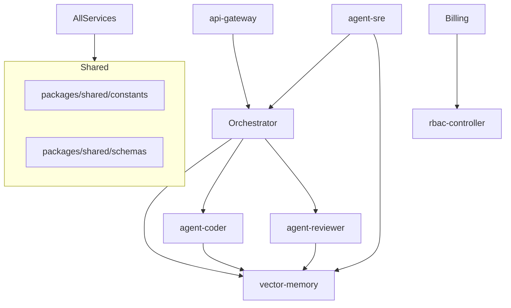

# Amaswarn Swarm Dependency Graph

This graph defines the "Who knows What" in the 22-microservice ecosystem.

## RULES:
- Arrows represent dependency direction.
- Circular dependencies are strictly FORBIDDEN.
- Every service must depend on `shared` for communication schemas.
